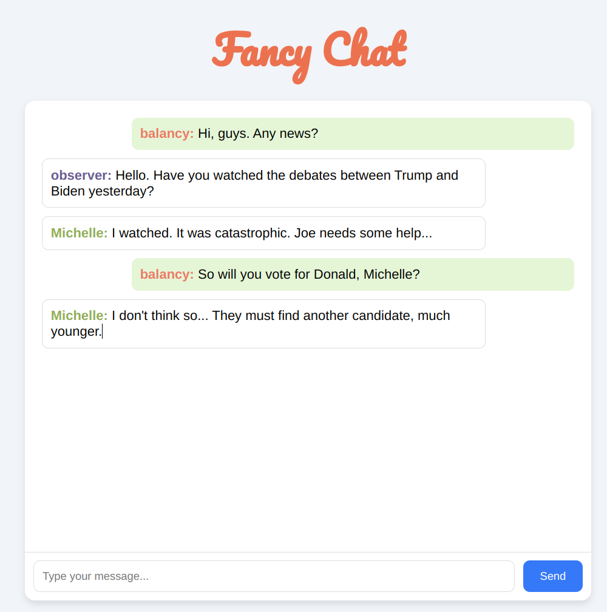

# Kafka + fastAPI chat

App represents a simple chat. Users can connect to web-chat, enter their name and start chatting.



## Installation

App needs Apache kafka server up and running. It also needs Python3.11 and Git installed in your system.

1. Download git repository.
```
git clone https://github.com/balancy/kafka_chat.git
```

2. Create virtual environment
```
python3.11 -m venv .venv
```

3. Install dependencies.
```
cd kafka_chat
pip install -r requirements.txt
```

4. Download Apache Kafka server.

Go to the second terminal tab.

```
wget https://downloads.apache.org/kafka/3.7.0/kafka_2.12-3.7.0.tgz
tar -xzf kafka_2.12-3.7.0.tgz
cd kafka_2.12-3.7.0
```

5. Start servers.

In this terminal tab run zookeeper server.
```
bin/zookeeper-server-start.sh config/zookeeper.properties
```

In the third terminal tab run kafka server.
```
bin/kafka-server-start.sh config/server.properties
```

6. Run the app.

Go the the first terminal tab and run the command.
```
uvicorn app.main:app --reload --port 8003
```

The chat will be available via http://127.0.0.1:8003
